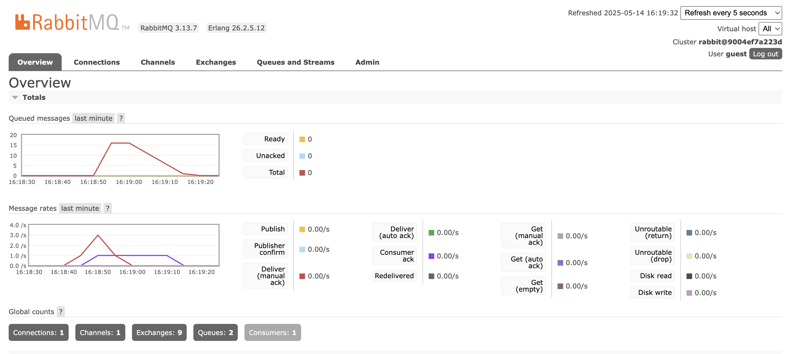

## What is amqp?  
AMQP (Advanced Message Queuing Protocol) is just a set of rules that lets different apps talk to each other by sending messages through a broker (like RabbitMQ). It makes sure messages get where they need to go and handles things like retries and confirmations for us.

## What does it mean? guest:guest@localhost:5672 , what is the first guest, and what is the second guest, and what is localhost:5672 is for? 
- **first `guest`**: the username we log in with  
- **second `guest`**: the password for that user  
- **`localhost:5672`**: the address (our own computer) and port (5672 is RabbitMQ’s default) where the broker is running  

## Simulation slow subscribe

The peak of “Total” hits 16 because the publisher sent messages faster than the subscriber could acknowledge them. Each time we ran the publisher it pushed another batch onto the queue, and because the consumer processes messages one by one, a backlog built up. The peak of 16 is just the highest number of unacknowledged messages waiting in the queue before the subscriber finally caught up and drove the count back down to zero.

